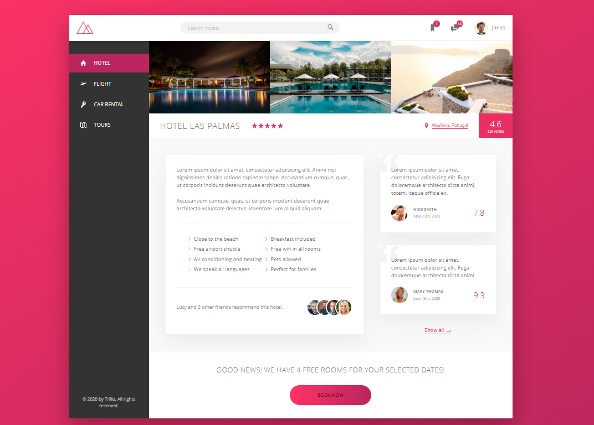

# Trillo app

> Trillo App is a booking app where users can search and book for hotels, flights, car rentals and tours.



 &nbsp; &nbsp;
 &nbsp;

## Table of contents

- [Trillo app](#trillo-app)
  - [Table of contents](#table-of-contents)
  - [General info](#general-info)
  - [Technologies](#technologies)
  - [Installation and Usage](#installation-and-usage)
    - [Dev Mode](#dev-mode)
    - [Prod Mode](#prod-mode)
    - [Live Demo](#live-demo)
  - [To-do list](#to-do-list)
  - [Status](#status)
  - [Contact](#contact)

## General info

Landing page project built purely in HTML5 and CSS3 with Sass using the flexbox module.
The main purpose for this project was to implement and how Flexbox works.

## Technologies

- HTML 5
- CSS3
- SCSS

## Installation and Usage

Prerequisites: [Node.js](https://nodejs.org/download/release/v13.14.0/) (13.14.0). As of latest version 14.3.0 some dependencies break at install.

To run this project:

- Clone this repo to your local machine using

```shell
$ git clone https://github.com/francislagares/trillo-app
```

- Switch into directory

```shell
$ cd trillo-app
```

- Install dependencies

```shell
$ yarn install
```

### Dev Mode

- Run server

```shell
$ yarn start
```

- Browser will open automatically at http://localhost:3000

### Prod Mode

- Make a build

```shell
$ yarn build
```

- Run Express Server

```shell
$ yarn serve
```

- Open http://localhost:3000 in your browser.

### Live Demo

You can see the application running
[here.](https://francislagares.github.io/trillo-app/)

## To-do list

So far this project is considered completed, there's a lot of improvements and features to be implemented though.

To-do list:

- Write mixins for different features for better and less repeating code.
- Make responsive HTML images with density and resolution technique.
- Implement dropdown menu.
- And the list can go on ...

## Status

Currently: _in progress_...

## Contact

Created by [@francislagares](https://www.linkedin.com/in/francislagares/) - feel free to contact me!

